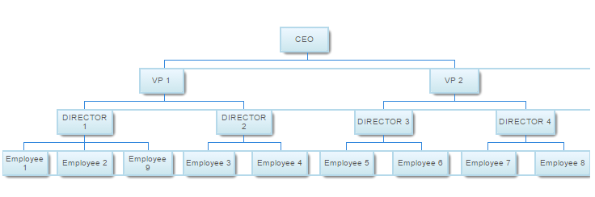

# Google Organization Chart extension for Qlik Sense
A Google Organization Chart extension for Qlik Sense as found at
[https://developers.google.com/chart/interactive/docs/gallery/orgchart](https://developers.google.com/chart/interactive/docs/gallery/orgchart)

included a sample QVF with the spreadsheet

## Installation
- [Download zip file](https://github.com/yianni-ververis/google-organizational-chart/archive/master.zip)
- Desktop - Unzip at the extension folder (C:\Users\<user>\Documents\Qlik\Sense\Extensions\GoogleOrganizationChart) 
- Server - Upload the zip file

## Usage

##### Dimensions and Measures
- add up to 3 dimensions with this order
  1. Name
  2. Manager, Reports to
  3. Description for Tooltip

##### Extension Settings
- No Settings Yet

---

[Download zip file](https://github.com/yianni-ververis/google-organizational-chart/archive/master.zip)